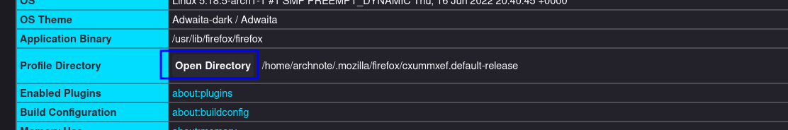
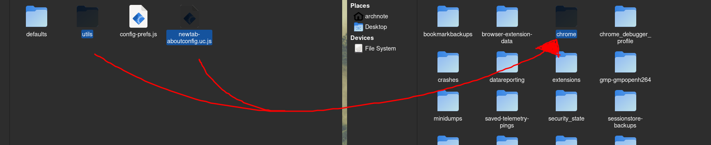
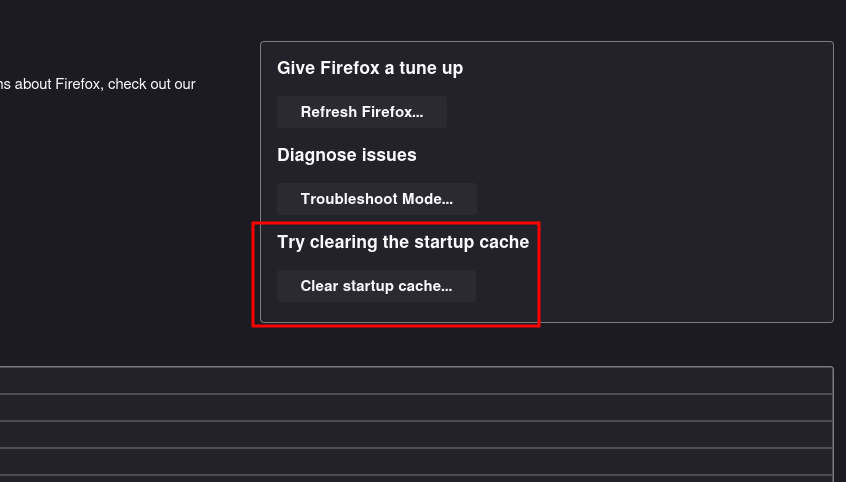
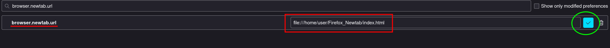

# Firefox-Newtab
*this video at ( https://www.youtube.com/watch?v=kf0RoPN-REo&t=243s ) 3:58 is the insrtuctions*
This can restore the option **browser.newtab.url** in the **about:config**.
With this option abavialble you can add your own local html file as a new tab

### Instructions
1. download repo:

  this should create a directory called FireFox-Newtab:

- `git clone https://github.com/RisedNote/Firefox-Newtab && cd Firefox-Newtab`

2. now you need to put the contents of **firefoxScripts** in their proper paths

> firefox can be installed in a different location but this is the default :arrow_down:

#### Linux:
copy `firefoxScripts/defaults/pref/config.js` to `/usr/lib/firefox/`:

- `cp firefoxScripts/defaults/pref/config.js /usr/lib/firefox/`

then copy `config-prefs.js` to `/usr/lib/firefox/browser/defaults/preferences/`:

- `cp firefoxScripts/config-prefs.js /usr/lib/firefox/browser/defaults/preferences/`

#### Windows:
just put both contents ( **firefoxScripts/config-prefs.js** and **firefoxScripts/defaults** ) in:

`C:\Program Files\Mozilla Firefox`

#### MacOS:
the **firefoxScripts/config-prefs.js** goes here:

- `Firefox.app/Contents/Resources/defaults/pref/config-prefs.js`

and **firefoxScripts/defaults/pref/config.js** goes here:

- `Firefox.app/Contents/Resources/defaults/pref/config-prefs.js`

3. now in the url bar of firefox type **about:support**

  look for **Profile Directory** or **Profile Folder** and click on the **open** button right next it

  

  in here create a folder called **chrome**

  Now insert the **utils** folder AND **newtab-aboutconfig.uc.js** in the **chrome** folder you just made

  

  *dont mind my drawing*
  
4. now go back to the **about:support** url
  
  click on the top right box where it says **Clear startup cache...** this will *restart firefox*

  

5. now type **about:config** in the url and this may warn you, just click continue

  now search for **browser.newtab.url** and here you can enter your local file path *make sure you have **file://** before your absolute path*

  
  
6. cleaning up

  now just move the **newtabPage** folder in a good place so you can link it to **browser.newtab.url**

  remove Firefox-Newtab folder: `cd .. && rm -rf Firefox-Newtab`

---

### The HTML file is based off of molecule47
this is the repo ( https://github.com/molecule47/idyllic-firefox ) where I got the html from, so thanks to them

the image I used for my html file is by "Samma van Klaarbergen":

https://www.artstation.com/artwork/PeB19L

---
 
### These are not my scripts
I got the scripts from xiaoxiaoflood at ( https://github.com/xiaoxiaoflood/firefox-scripts )

this repo gives you more modifications with firefox so check it out
